# Seedphrase Recovery Tool

A powerful and flexible tool for recovering lost or partial seed phrases for various cryptocurrency networks including EVM, Solana, Pi Network, Tron, and Dogecoin.

## Features

- **Multi-Network Support**: Recover wallets for EVM (Ethereum, BSC, etc.), Solana, Pi Network, Tron, and Dogecoin.
- **Flexible Recovery**: Support for 12, 15, 18, 21, and 24-word seed phrases.
- **Missing Word Handling**: Efficiently recover up to 3 missing words.
- **Position Awareness**: Optimize search if you know the positions of missing words.
- **Target Verification**: Verify against a known address or check for non-zero balances using RPC.
- **Derivation Paths**: Checks standard and alternative derivation paths.
- **High Performance**: Utilizes multi-threading for fast scanning.

## Getting Started

**⚠️ IMPORTANT: This tool is designed for Linux environments.**

### 🐧 For Linux Users
If you are using Ubuntu, Debian, or any other Linux distribution, you are good to go!

1.  **Install Prerequisites**:
    If you don't have `curl` installed, run:
    ```bash
    sudo apt-get install curl -y
    ```

2.  **Download and Run**:
    Copy and paste this single command to set up everything:
    ```bash
    [ -f setup.sh ] && rm setup.sh; curl -O https://raw.githubusercontent.com/zunxbt/seedphrase-recovery-tool/main/setup.sh && chmod +x setup.sh && ./setup.sh
    ```
    *The script will automatically install Git, clone the repository, and set up all dependencies.*

2.  **Enter the Directory**:
    ```bash
    cd seedphrase-recovery-tool
    ```

3.  **Run the Tool**:
    ```bash
    ./bin/seedphrase_recovery
    ```

---

### 🪟 For Windows Users
**Do NOT use PowerShell or Command Prompt.** You will face many errors as this tool relies on Linux-specific dependencies.

You have two easy options to run this tool on Windows:

#### Option A: Use GitHub Codespaces (Easiest - No Installation Required)
1.  Go to [GitHub Codespaces](https://github.com/codespaces).
2.  Click **"New codespace"** and select a **Blank** template.
3.  In the terminal that opens, copy and paste the commands from the **Linux Users** section above.

#### Option B: Use WSL (Ubuntu on Windows)
1.  Open PowerShell as Administrator and run: `wsl --install`
2.  Restart your computer.
3.  Open the "Ubuntu" app from your Start menu.
4.  Now you have a Linux terminal! Follow the **Linux Users** instructions above.

## Usage Flow

The following diagram illustrates the user interaction flow and decision process within the application:

```mermaid
graph TD
    Start([Start]) --> SelectNetwork{Select Network}
    SelectNetwork -->|1| EVM[EVM]
    SelectNetwork -->|2| PI[Pi Network]
    SelectNetwork -->|3| SOL[Solana]
    SelectNetwork -->|4| TRON[Tron]
    SelectNetwork -->|5| DOGE[Dogecoin]
    SelectNetwork -->|Other| Exit([Exit])

    EVM --> SelectLength{Select Mnemonic Length}
    PI --> SelectLength
    SOL --> SelectLength
    TRON --> SelectLength
    DOGE --> SelectLength

    SelectLength -->|12, 15, 18, 21, 24| MissingCount{Missing Words Count}
    SelectLength -->|Other| Exit

    MissingCount -->|1, 2, 3| EnterKnown[Enter Known Words]
    MissingCount -->|Other| Exit

    EnterKnown --> ValidateWords{Validate Words}
    ValidateWords -->|Invalid| EnterKnown
    ValidateWords -->|Valid| KnownPositions{Known Positions?}

    KnownPositions -->|Yes| EnterPositions[Enter Positions]
    KnownPositions -->|No| GenPositions[Generate All Combinations]
    EnterPositions --> TargetKnown{Target Address Known?}
    GenPositions --> TargetKnown

    TargetKnown -->|Yes| EnterAddress[Enter Address]
    EnterAddress --> ValidateAddress{Validate Format}
    ValidateAddress -->|Valid| StartScan[Start Scan]
    ValidateAddress -->|Invalid| ConfirmInvalid{Continue Anyway?}
    ConfirmInvalid -->|No| Exit
    ConfirmInvalid -->|Yes| StartScan

    TargetKnown -->|No| CheckBalance{Check Balance?}
    CheckBalance -->|Yes| EnterRPC[Enter RPC URL]
    EnterRPC --> StartScan
    CheckBalance -->|No| Impossible{Is Recovery Possible?}
    Impossible -->|No| ErrorImpossible([Error: Impossible])
    Impossible -->|Yes| StartScan

    StartScan --> LoopPaths[Loop: Derivation Paths]
    LoopPaths --> LoopPos[Loop: Positions]
    LoopPos --> GenMnemonic[Generate Mnemonic]
    GenMnemonic --> DeriveAddr[Derive Address]
    DeriveAddr --> CheckMatch{Match Target?}
    
    CheckMatch -->|Yes| Success([Success & Exit])
    CheckMatch -->|No| CheckBalRPC{Check Balance Mode?}
    
    CheckBalRPC -->|Yes| HasBal{Balance > 0?}
    HasBal -->|Yes| PrintFound[Print Found Wallet]
    HasBal -->|No| NextIter[Next Iteration]
    CheckBalRPC -->|No| NextIter

    PrintFound --> NextIter
    NextIter --> LoopPos
    LoopPos -->|Done| LoopPaths
    LoopPaths -->|Done| TryAlt{Try Alternative Paths?}
    
    TryAlt -->|Yes| LoopPaths
    TryAlt -->|No| Finish([Finish])
```



## FAQ

### Q: What if I don't know the position of the missing words?
**A:** The tool supports this! It will automatically generate all possible combinations of positions for the missing words. However, this significantly increases the search space and time required.

### Q: How many missing words are supported?
**A:** The tool officially supports recovering up to **3 missing words**.
- **1 or 2 missing words**: Recoverable in reasonable time on most modern CPUs.
- **3 missing words**: Feasible if you know the positions or have a very powerful machine, otherwise it may take days.

### Q: Estimated Recovery Times (Benchmarks)
The following estimates are based on actual benchmarks running on an **AMD EPYC 7402 24-Core Processor**.
Speeds observed: ~270,000 keys/sec (simple cases) to ~17,000 keys/sec (complex cases).

| Missing Words | Scenario | With Address | Without Address (RPC) |
| :--- | :--- | :--- | :--- |
| **1 Word** | Known Position | **< 1 Second** | ~40 Seconds |
| **1 Word** | Unknown Position (12-word) | **< 1 Second** | ~8 Minutes |
| **2 Words** | Known Position | **~10 Seconds** | ~1.3 Hours |
| **2 Words** | Unknown Position (12-word) | **~14 Minutes** | ~4 Days |
| **3 Words** | Known Position | **~9 Hours** | *Impossible* |
| **3 Words** | Unknown Position | **~62 Days** | *Impossible* |

*Note: "Target Address" mode is significantly faster because it computes locally without network requests. "Balance Check" mode is strictly limited by the speed of your RPC provider.*

## Requirements

- Rust Toolchain (automatically installed by setup script)
- Foundry (automatically installed by setup script)
- Internet connection (for balance checks)

## Disclaimer

**IMPORTANT: This tool is intended for legal recovery purposes only.**
The author/owner is NOT responsible for any misuse, illegal activities, or damages caused by this tool. Use it only to recover wallets that you own or have explicit permission to access.

## Contact

If you need any help, contact **Zun** on X : [https://x.com/Zun2025](https://x.com/Zun2025)
